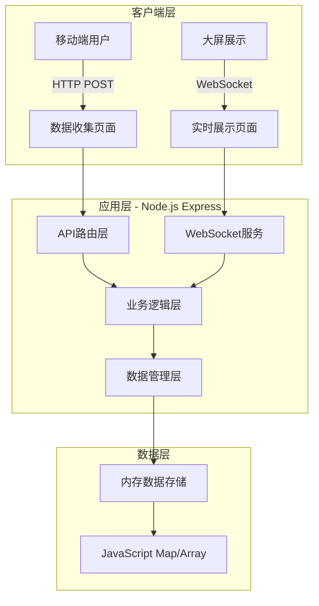

# 互动目标展示系统 - 系统架构设计

## 1. 架构设计原则

### 1.1 核心设计原则
- **极简主义**：最简单的技术栈，最少的组件数量
- **性能优先**：针对2c2G服务器优化，内存和CPU使用最小化
- **高可用性**：单点故障不影响核心功能，快速恢复
- **用户体验**：友好的错误处理，流畅的交互体验

### 1.2 技术约束条件
- **服务器配置**：2核2GB内存
- **存储方式**：纯内存存储，无持久化依赖
- **部署方式**：单服务，单域名
- **并发要求**：支持100个用户同时提交
- **实时性**：大屏使用WebSocket实时展示，提交页面使用HTTP

## 2. 系统架构图



## 3. 技术栈选择

### 3.1 后端技术栈
```javascript
// 核心框架
- Node.js (v16+) - 轻量级运行时
- Express.js - 简单的Web框架
- ws (WebSocket库) - 实时通信
- qrcode - 二维码生成

// 数据处理
- 内存存储 (JavaScript Map + Array)
- 简单的内存锁机制防止并发问题
```

### 3.2 前端技术栈
```html
<!-- 大屏展示页面 -->
- 纯HTML5 + CSS3 + JavaScript
- WebSocket客户端 (原生)
- CSS动画 (排名变化效果)

<!-- 数据收集页面 -->
- 移动端优化表单
- 表单验证和友好的错误提示
- 简洁的响应式设计
```

## 4. 系统架构设计

### 4.1 单体应用架构
```javascript
// app.js - 应用入口
const express = require('express');
const WebSocket = require('ws');
const path = require('path');
const QRCode = require('qrcode');

// 内存数据存储
const participants = new Map(); // participantId -> participant data
let nextId = 1;
```

### 4.2 数据存储结构
```javascript
// 参与者数据结构
const participantStructure = {
  id: "number",           // 唯一ID
  organization: "string",  // 机构名称 (50字符)
  name: "string",         // 姓名 (20字符)
  target: "number",       // 目标金额 (正数)
  timestamp: "number"     // 提交时间戳
};

// 排序缓存
let sortedParticipants = []; // 按金额排序的参与者数组
let lastUpdateTime = 0;
```

### 4.3 性能优化设计

#### 4.3.1 内存管理
```javascript
// 内存使用估算：
// 每条记录约100字节，100条记录约10KB
// 总内存占用 < 1MB，完全在2GB限制内

// 内存清理机制
const MAX_PARTICIPANTS = 500; // 最大支持500条记录
function cleanupOldRecords() {
  // 超过最大数量时清理最早的记录
}
```

#### 4.3.2 CPU优化
```javascript
// 排序优化：只在需要时重新排序
function sortParticipants() {
  if (Date.now() - lastUpdateTime < 1000) {
    return sortedParticipants; // 1秒内不重复排序
  }

  sortedParticipants = Array.from(participants.values())
    .sort((a, b) => b.target - a.target);
  lastUpdateTime = Date.now();

  return sortedParticipants;
}
```

## 5. 路由设计 - 单域名多路径

### 5.1 URL路径规划
```
主域名: https://meeting.example.com

页面路由:
├── /                    - 大屏展示页面 (主页)
├── /submit               - 数据收集页面 (二维码跳转地址)
├── /admin                - 管理页面 (数据管理，可选)
└── /api/qrcode           - 获取二维码图片

API路由:
├── POST /api/participant - 提交参与者信息
├── GET /api/participants - 获取参与者列表
├── DELETE /api/participants - 清空所有数据
└── GET /api/stats        - 获取统计信息

WebSocket路由:
└── /ws                   - 实时数据推送端点
```

### 5.2 Express路由实现
```javascript
// 路由配置
app.get('/', (req, res) => {
  res.sendFile(path.join(__dirname, 'public', 'display.html'));
});

app.get('/submit', (req, res) => {
  res.sendFile(path.join(__dirname, 'public', 'submit.html'));
});

app.get('/admin', (req, res) => {
  res.sendFile(path.join(__dirname, 'public', 'admin.html'));
});

// API路由
app.post('/api/participant', submitParticipant);
app.get('/api/participants', getParticipants);
app.delete('/api/participants', clearParticipants);
app.get('/api/qrcode', generateQRCode);

// WebSocket路由
const wss = new WebSocket.Server({ path: '/ws', server: httpServer });
```

## 6. 错误处理和用户体验设计

### 6.1 提交失败友好响应
```javascript
// 错误类型和友好提示
const errorMessages = {
  'MISSING_REQUIRED': '请填写所有必填字段',
  'INVALID_FORMAT': '请检查输入格式是否正确',
  'DUPLICATE_ENTRY': '您已经提交过了，相同设备可修改数据',
  'SERVER_BUSY': '系统繁忙，请稍后重试',
  'RATE_LIMIT': '提交太频繁，请等待几秒后再试',
  'MAX_PARTICIPANTS': '参与人数已达上限'
};

// 友好的错误响应
function createErrorResponse(res, errorType, details = null) {
  return res.status(400).json({
    success: false,
    message: errorMessages[errorType] || '操作失败，请重试',
    errorType: errorType,
    details: details,
    timestamp: Date.now()
  });
}
```

### 6.2 表单验证和处理
```javascript
// 客户端验证
function validateForm(data) {
  const errors = [];

  if (!data.organization || data.organization.trim().length === 0) {
    errors.push('机构名称不能为空');
  }
  if (data.organization && data.organization.length > 50) {
    errors.push('机构名称不能超过50个字符');
  }

  if (!data.name || data.name.trim().length === 0) {
    errors.push('姓名不能为空');
  }
  if (data.name && data.name.length > 20) {
    errors.push('姓名不能超过20个字符');
  }

  if (!data.target || isNaN(data.target) || Number(data.target) <= 0) {
    errors.push('目标金额必须是大于0的数字');
  }
  if (Number(data.target) > 999999.99) {
    errors.push('目标金额不能超过999,999.99');
  }

  return errors;
}
```

### 6.3 重复提交防护
```javascript
// 基于IP和时间的防重提交机制
const submitCache = new Map(); // ip -> last submit time

function checkRateLimit(ip) {
  const lastSubmit = submitCache.get(ip) || 0;
  const now = Date.now();

  if (now - lastSubmit < 5000) { // 5秒内不能重复提交
    return false;
  }

  submitCache.set(ip, now);
  return true;
}
```

## 7. 实时数据推送设计

### 7.1 WebSocket广播机制
```javascript
// WebSocket连接管理
const clients = new Set();

wss.on('connection', (ws) => {
  clients.add(ws);
  console.log('WebSocket客户端连接，当前连接数:', clients.size);

  // 发送当前数据
  ws.send(JSON.stringify({
    type: 'initial',
    data: sortParticipants()
  }));

  ws.on('close', () => {
    clients.delete(ws);
  });
});

// 广播数据更新
function broadcastUpdate(data) {
  const message = JSON.stringify({
    type: 'update',
    data: data,
    timestamp: Date.now()
  });

  clients.forEach(ws => {
    if (ws.readyState === WebSocket.OPEN) {
      ws.send(message);
    }
  });
}
```

### 7.2 大屏展示优化
```javascript
// 前端WebSocket客户端
class DisplayManager {
  constructor() {
    this.ws = new WebSocket(`ws://${location.host}/ws`);
    this.setupEventHandlers();
  }

  setupEventHandlers() {
    this.ws.onmessage = (event) => {
      const data = JSON.parse(event.data);

      if (data.type === 'update') {
        this.updateDisplay(data.data);
      }
    };

    this.ws.onclose = () => {
      this.reconnect(); // 自动重连
    };
  }

  updateDisplay(participants) {
    // 平滑更新显示内容
    this.animateRankingChange(participants);
  }

  animateRankingChange(newData) {
    // 排名变化的动画效果
    // 新数据渐入，排名变化时平滑过渡
  }
}
```

## 8. 资源使用估算

### 8.1 内存使用分析
```
基础进程: ~100MB
数据存储: ~1MB (500条记录 × 200字节)
WebSocket连接: ~10MB (100个连接 × 100KB)
空闲缓存: ~50MB
总计预估: ~160MB (远低于2GB限制)
```

### 8.2 CPU使用分析
```
请求处理: 单次<5ms，100个并发<500ms
排序操作: 500条记录排序<10ms
WebSocket广播: 100个连接广播<20ms
CPU使用率预估: <20% (2核CPU)
```

### 8.3 网络带宽估算
```
提交请求: 1KB/次 × 100 = 100KB/秒
WebSocket推送: 2KB/次 × 100 = 200KB/秒
页面访问: 500KB/次 × 10 = 5MB/分钟
总带宽需求: <1Mbps
```

## 9. 部署方案

### 9.1 Docker化部署
```dockerfile
FROM node:16-alpine
WORKDIR /app
COPY package*.json ./
RUN npm install --production
COPY . .
EXPOSE 3000
CMD ["node", "app.js"]
```

### 9.2 启动脚本
```bash
#!/bin/bash
# start.sh
echo "启动互动目标展示系统..."
npm install
node app.js
```

### 9.3 监控和日志
```javascript
// 简单的监控中间件
app.use((req, res, next) => {
  const start = Date.now();

  res.on('finish', () => {
    const duration = Date.now() - start;
    console.log(`${req.method} ${req.path} - ${res.statusCode} - ${duration}ms`);
  });

  next();
});

// 定期输出系统状态
setInterval(() => {
  console.log(`系统状态 - 参与者: ${participants.size}, WebSocket连接: ${clients.size}, 内存使用: ${process.memoryUsage().heapUsed / 1024 / 1024}MB`);
}, 30000);
```

## 10. 故障处理和恢复

### 10.1 服务重启
```javascript
// 优雅关闭处理
process.on('SIGTERM', () => {
  console.log('收到SIGTERM信号，开始优雅关闭...');
  wss.close();
  server.close(() => {
    console.log('服务器已关闭');
    process.exit(0);
  });
});
```

### 10.2 内存泄漏防护
```javascript
// 内存使用监控
setInterval(() => {
  const memUsage = process.memoryUsage();
  if (memUsage.heapUsed > 1024 * 1024 * 1024) { // 1GB
    console.warn('内存使用过高，触发清理');
    participants.clear(); // 清空数据保护服务器
  }
}, 60000);
```

## 11. 性能测试建议

### 11.1 负载测试场景
```
场景1: 100个用户同时提交数据
场景2: 10个大屏同时连接WebSocket
场景3: 持续1小时的中等负载
场景4: 突发500个用户访问提交页面
```

### 11.2 监控指标
```
响应时间: <100ms (99%的请求)
错误率: <1%
内存使用: <500MB
CPU使用率: <50%
```

## 12. 技术风险控制

### 12.1 主要风险点
- **内存溢出**: 设置最大参与者数量限制
- **CPU过载**: 实现请求队列和限流
- **网络拥堵**: 实现WebSocket连接数限制
- **单点故障**: 快速重启机制

### 12.2 缓解措施
```javascript
// 连接数限制
const MAX_WS_CONNECTIONS = 50;
if (clients.size >= MAX_WS_CONNECTIONS) {
  ws.close(1008, '连接数已达上限');
}

// 请求队列
const requestQueue = [];
const MAX_QUEUE_SIZE = 200;
```

---

**架构设计特点**：
1. ✅ 极简架构：单个Express应用，无外部依赖
2. ✅ 性能优化：针对2c2G服务器优化，预估使用率<20%
3. ✅ 友好体验：完善的错误处理和用户提示
4. ✅ 路径规划：单一域名，清晰的路由结构
5. ✅ 容错设计：内存保护，优雅降级

**文档版本**: v1.0
**创建日期**: 2024年11月22日